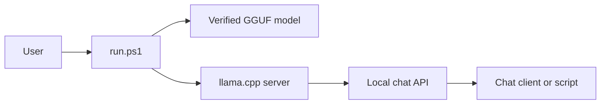

# Qwen CPU LLM Runner

[](https://github.com/CaptnSalazar/qwen-cpu-llm-runner/actions/workflows/validate.yml) [](LICENSE) [](https://github.com/CaptnSalazar/qwen-cpu-llm-runner/issues)

Run Qwen GGUF models locally on Windows with no cloud dependency. This launcher installs a portable [llama.cpp](https://github.com/ggml-org/llama.cpp) runtime, downloads verified model files, starts a local OpenAI-compatible API, and includes a quick latency smoke test.

**Privacy-first:** your model and inference server stay on your PC. The installer only reaches upstream release endpoints to fetch the runtime or model you selected.

### Why this project

- Run a 32B-class local model with CPU, CUDA, or Vulkan
- Download only the preset you choose, with SHA-256 verification
- Expose a local chat-completions endpoint at `http://127.0.0.1:8080`
- Benchmark latency and direct-answer behavior on your hardware

## Contents

- [Quick start](#quick-start)
- [Choose a runtime backend](#choose-a-runtime-backend)
- [Run modes](#run-modes)
- [Models and tuning](#models-and-tuning)
- [Evaluation](#evaluation)
- [Project layout](#project-layout)
- [Contributing and security](#contributing-and-security)

## Choose your setup

| Your hardware | Start with | Why |
| --- | --- | --- |
| CPU-only, 32 GB RAM | `qwen3-32b-q4` | Smaller download and memory footprint |
| CPU-only, 48 GB+ RAM | `qwen3-32b-q6` | Highest shipped quality |
| NVIDIA GPU | CUDA + Q4 or Q6 | GPU layer offload through a CUDA runtime |
| AMD or Intel GPU | Vulkan + Q4 or Q6 | Broad accelerator support where Vulkan is available |

The Q4 preset is the practical starting point for most machines. Move to Q6 when you have the memory headroom and want the best quality available in this repository.



## Highlights

- Accuracy-first default: official Qwen3-32B Q6_K GGUF (26.9 GB).
- CPU-only, CUDA, and Vulkan runtime installation.
- Local chat-completions endpoint at `127.0.0.1:8080`.
- SHA-256 model validation after download.
- Direct-answer (`-NoReasoning`) mode for low-overhead tasks.
- Reproducible streaming latency and correctness smoke evaluation.

## Requirements

- Windows 10/11 x64 and Windows PowerShell 5.1+ or PowerShell 7.
- Q4 needs roughly **22 GB RAM** before context and operating-system overhead; 28 GB is recommended. Q6 needs roughly **30 GB** before overhead; 40 GB is recommended, and 48 GB+ is more comfortable with a 16K context.
- Roughly 30 GB of free disk for Q6, or 22 GB for Q4, plus runtime overhead.
- Internet access only during installation/model download.

## Quick start

Run these from the repository root in PowerShell:

```powershell
Set-ExecutionPolicy -Scope Process Bypass
.\scripts\install-llama-cpp.ps1 -Backend cpu
.\run.ps1 -Mode download -Model qwen3-32b-q4
.\run.ps1
```

You should then see a local interactive chat prompt. For server mode, the useful endpoint is:

```text
http://127.0.0.1:8080/v1/chat/completions
```

The first model load is intentionally slow on CPU: it maps the model and creates its context cache. Use `qwen3-32b-q6` in the download command when you have the memory headroom for the larger preset.

The installer defaults to the tested llama.cpp build `b10930` and verifies release-asset checksums when upstream provides them. Use `-Version latest` only when you are intentionally testing a newer upstream build.

### Choose a runtime backend

```powershell
# CPU-only: works everywhere on x64 Windows
.\scripts\install-llama-cpp.ps1 -Backend cpu

# NVIDIA GPU with a compatible CUDA driver
.\scripts\install-llama-cpp.ps1 -Backend cuda

# Broad GPU support where Vulkan is available
.\scripts\install-llama-cpp.ps1 -Backend vulkan
```

Use `-GpuLayers 0` or `-NoGpu` to force CPU inference. With an accelerator build, the runner tries to offload all layers; set `-GpuLayers N` to stay within VRAM.

## Run modes

Interactive chat:

```powershell
.\run.ps1
```

Single prompt:

```powershell
.\run.ps1 -Prompt "Explain database index trade-offs in three bullets."
```

Local server:

```powershell
.\run.ps1 -Mode server -Port 8080
```

The API is available at `http://127.0.0.1:8080/v1/chat/completions`. It binds to loopback by default. Do not use `-ListenAddress 0.0.0.0` unless you provide authentication and network controls separately.

To require a bearer token, pass an API key when starting the server:

```powershell
.\run.ps1 -Mode server -ApiKey "replace-with-a-long-random-secret"
```

### Direct-answer mode (no reasoning)

For short, straightforward responses without reasoning tokens, stop the current server with `Ctrl+C` and start a new one:

```powershell
.\run.ps1 -Mode server -NoReasoning
```

`-NoReasoning` applies when the server starts; it cannot change an already-running process.

## Models and tuning

| Preset | Weights | Intended use | Default context |
| --- | ---: | --- | ---: |
| `qwen3-32b-q6` | 26.9 GB | Best shipped quality / CPU latency is acceptable | 16,384 |
| `qwen3-32b-q4` | 19.8 GB | Lower-memory fallback | 8,192 |

The shipped model files come from Qwen's Apache-2.0 GGUF repository. Their expected SHA-256 digests are in [config/models.json](config/models.json) and are checked at download completion. Recheck an existing model with:

```powershell
.\run.ps1 -VerifyModel
```

Useful overrides:

```powershell
# Reduce CPU contention and extend context when you have enough memory
.\run.ps1 -Threads 12 -ContextSize 32768

# Use the smaller preset
.\run.ps1 -Model qwen3-32b-q4

# Validate the installation and detected runtime
.\run.ps1 -Mode doctor

# Run the local smoke benchmark through the main launcher
.\run.ps1 -Mode benchmark
```

## Evaluation

With a no-reasoning server already running, execute:

```powershell
.\scripts\smoke-eval.ps1
```

The evaluator warms the model, sends three short direct-answer prompts with `temperature: 0`, streams responses, and reports first visible token time, total time, output, and exact-match correctness. Each completed run is stored as a timestamped JSON file in `benchmarks/` (ignored by Git). See [docs/evaluation.md](docs/evaluation.md) for methodology and [docs/performance.md](docs/performance.md) for hardware expectations and recorded reports.

### Measured CPU latency baseline

The following is the first measured local baseline for this project. It used the Qwen3-32B Q6_K model (26.9 GB) with the CPU-only llama.cpp `b10930` build, 31 threads, and a 16,384-token context on Windows 10 with 32 logical CPUs.

| Direct-answer case | Total API completion latency |
| --- | ---: |
| Arithmetic | 73.56 s |
| Geography | 67.80 s |
| Number pattern | 73.69 s |
| **Mean** | **71.68 s** |

This is a conservative CPU-only reference, not a quality score: the server for that first run was still configured for automatic reasoning while each request was capped at four output tokens. It therefore emitted no visible final answer, and those three cases are **not scored for correctness**. Restart with `-NoReasoning` and use the included evaluator to produce a valid direct-answer result for your hardware. Keep model, quantization, context size, thread count, and backend in every published comparison.

### Performance defaults

The launcher uses all but one logical CPU by default, assigns the same count to prompt/batch processing, and lets llama.cpp automatically select Flash Attention when supported. It keeps the accuracy-first Q6 quantization and 16K context; both materially increase memory use and CPU latency. For faster local responses, use the Q4 preset and a smaller context:

```powershell
.\run.ps1 -Mode server -Model qwen3-32b-q4 -ContextSize 4096 -NoReasoning
```

## Project layout

```text
config/models.json                Shipped model presets and hashes
run.ps1                           Chat, server, download, and diagnostic launcher
scripts/install-llama-cpp.ps1     Portable llama.cpp installer
scripts/smoke-eval.ps1            Local direct-answer latency smoke evaluation
benchmarks/                       Local timestamped evaluation reports (ignored by Git)
docs/evaluation.md                Methodology and measured baseline
docs/performance.md               Hardware guidance and performance reports
tests/validate.ps1                Offline syntax and preset validation
.github/workflows/validate.yml    GitHub Actions syntax/configuration validation
.github/ISSUE_TEMPLATE/           Bug and performance report forms
```

## Contributing and security

Please read [CONTRIBUTING.md](CONTRIBUTING.md) before opening a pull request and [SECURITY.md](SECURITY.md) before reporting a security issue. The launcher code is MIT licensed; llama.cpp and model weights are separate projects with their own licenses. Do not redistribute model weights without complying with their license.

The project is maintained by [Yash Shukla (@CaptnSalazar)](AUTHORS.md).
